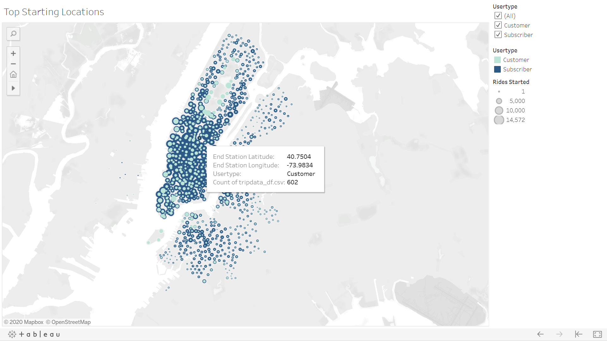
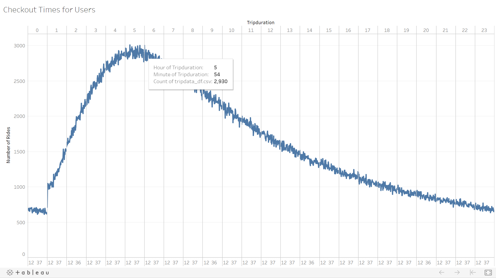
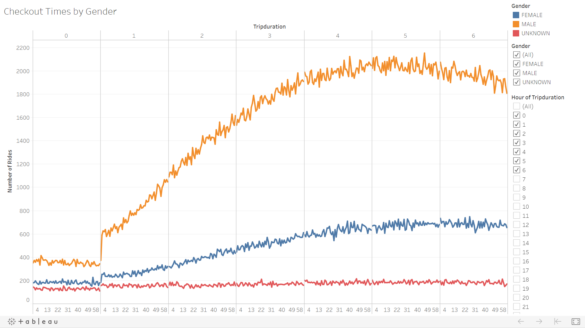
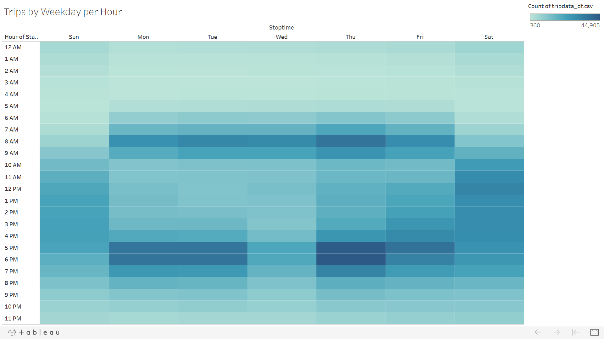
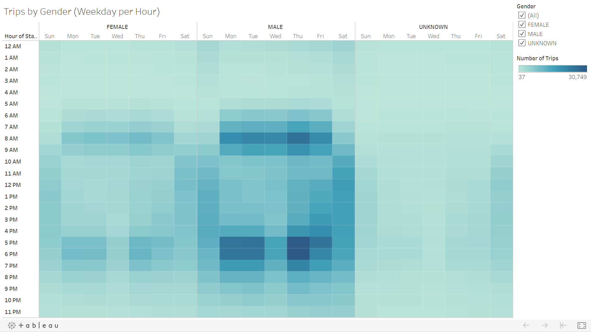
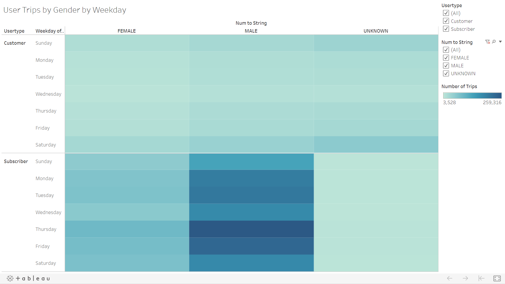
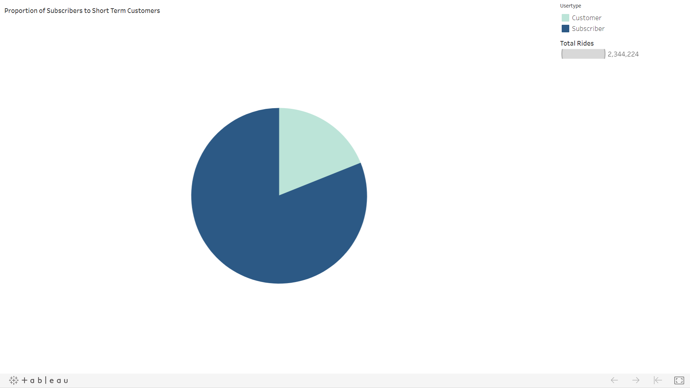

# CitiBike Des Moines Proposal

## Overview
Last summer I was fortunate enough to take the trip of a lifetime with one of my work partners.  Normally I'm a "hop-on, hop-off" trolley kind of tourist.  For this trip, my friend and I wanted to find a healthier option that would allow us more freedome for sightseeing.  We decided to use CitiBike, and we loved it so much we want to bring it back to Des Moines.  We believe that CitiBike can lead to a heathier Des Monies overall by reducing emissions, increasing opportunities to breathe fresh air, and helping everyone close their Activity ring.  We used data from New York City in August to create some visualizations that will help us communicate with our investors.

## Results
CitiBike customers took a total of 2,344,224 trips in the month of August.  Let's see what the data can tell us about what kind of customer uses CitiBike, and if it would be a good fit for Des Moines.

Here we can see that most trips begin in the downtown area.  The begs the questions, "Are the majority of riders tourists or commuters?"  The filter on this map will help us compare, but we can also look at a little more information about the trips people are taking.

We can see on this line chart that most rides last between three and six hours.  I wonder if these users are taking a long, scenic ride like my partner and I did.  Maybe they are riders who commuted to work, but reserved the bike for the ride home.  Let's see what else we can learn.

Wow!  When we breakdown those trips by the gender of the rider, we can see that most customers are males.  We still aren't sure if these guys are saving the environment on their way to work, or cruising around the city taking in the sights.

This heat map shows that most trips begin 8AM-9AM and 5PM-7PM on weekdays.  There is some moderate afternoon acitivity on the weekends.

Drilling down to look at when each gender begins their trip, it appears Rush Hours are still the busiest regardelss of gender.  It also confirms that males are the majority of riders.

When we split the heat map between Short Term Customers and Subscribers, we can see that the majority of rides are taken by male subscribers on any day of the week.

This pie chart shows the proportion of Subscribers to Short Term Customers.  Overwhelmingly, the CitiBike customer is a subscriber. 

## Analysis
The above visualizations and the [Tableau Story]("https://public.tableau.com/profile/leah.braswell#!/vizhome/CitiBikeProposal/NYCCitiBikeData") I've created tell us a lot about what kind of person uses CitiBikes.  Based on the data we have, male subscribers (most likely on their work commute) are the heaviest users of CitiBike.  This could work to keep Des Moines clean, green, and healthy.  More information would be helpful to determine the cost of maintaining the bikes.  It would be helpful to compare staring and ending locations of each individual bike trip.  It would help us know if most trips are short, one-way rides or if the user is riding round-trip and possibly not putting as many miles on the bike.  Number of rides by age would be helpful to know as well.  Perhaps the bikes are being used by college students and future executives alike!

